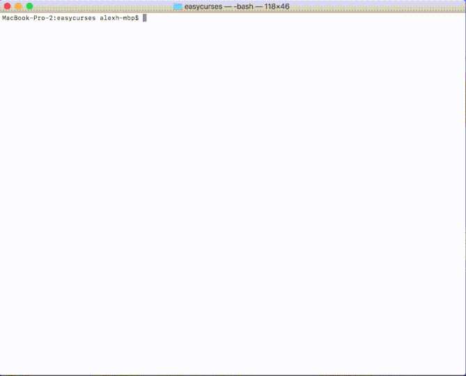

# For making text-based UIs


Sad that making those new-fangled moving pictures can be so complicated?
Do you *really* not care about the quality of your graphics as long it works?

Well suffer no more!




(gif with extra jpeg for your pleasure)


# life of py (with fewer tigers)
```
from easycurses import *
from time import sleep
def life(): #conway's game of life. 
    try:
        dc = DrawController()
        dc.init_screen()
        dc.full_draw()
        h,w = dc.size
        y,x = h//2,w//2 #center of screen
        
        #Initial state of grid (r-pentomino)
        active = [
        (y,x),
        (y,x+1),
        (y+1,x+1),
        (y+1,x+2),
        (y+2,x+1)
        ]

        active = map(lambda p:Pair(p[0],p[1]), active)
        while True:
            for a in active:
                c = Char(a, ' ', color=ColorController.get_color("white","white"))
                dc.draw([c])

            dc.render()

            n_count = defaultdict(int)
            for o in active:
                for n in o.get_neighbors(ortho=False):
                    n_count[n]+=1

            new_active = []
            for k in n_count.keys():
                c = n_count[k]
                if k not in active and c == 3:
                    new_active.append(k)
                elif k in active and c in [2,3]:
                    new_active.append(k)

            active = new_active
            sleep(.05)
    finally:
        dc.end() #do this to restore terminal to normal.
life()
```

## The important bits for this example

```
dc = DrawController()
dc.init_screen()
dc.full_draw()
h,w = dc.size
```

The full draw is important as it initializes all cells to their default value.

You can specify the global default or provide specific defaults for cells that satisfy a property (like "any cell below the 10th row should be a magenta asterisk", or "cells with an odd x-coordinate should be red")

```
for a in active:
    c = Char(a, ' ', color=ColorController.get_color("white","white"))
    dc.draw([c])

dc.render()
```

The only thing you can draw to the screen is a `Char`. It needs a position, display character, and can optionally receive a color pair. 

the `DrawController`'s `draw` method takes a *list* of characters to draw.

```
dc.end()
```

Your shell will be all sorts of messed up after your code if it doesn't end with this.

# The classes

## Pair

The `Pair` class is just a 2D coordinate (vector) in the form of (y,x). The `Char` class automatically converts tuples to a Pair, so you don't need to use it at all. `Pair` has some utility functions I use. 

## Char

Char holds on to the information to display a character
* position (internally a `Pair`, but you can use tuples)
* the actual ascii character to display
* an optional color

## ColorController

It's a singleton, with some static methods thrown in to make it so you don't need to grab an instance. Don't ever do `ColorController()`. It isn't necessary.

So the original `curses` makes you initialize a "color pair" and assign an int id to it. That's too much effort, so just do `ColorController.get_color(text_color, background_color)`. It returns an int that all the other classes interpret as the colors you wanted. 

## DrawController

The actual class that does stuff. It doesn't display stuff till you call `render`. If you want something to display the next time `render` is called you *must* `draw` it every time. 

If you want things to stay on-screen, you have to make a "rule". 

`dc.add_rule(1, lambda p:p[0] % 2 == 0, "#", color=ColorController.get_color("red", "black"))`

**That** rule would make it so any coordinate that satisfies our lambda `lambda p:p[0] % 2 == 0` (even numbered rows), will **default** to a red # on a black background. 

It only **defaults** to that. If you actively draw anything at a position satisfying that rule, that will be displayed instead.

The life example above has the standard default character (a black space on a black background).

To change that you could do:

```
dc.add_rule(1, lambda p:True, ' ', color=ColorController.get_color("cyan", "cyan"))
```

The first argument, the integer, specifies the id of the rule if you ever want to change or remove it. (Using `update_rule` or `remove_rule`)

An error will be thrown if you add a rule with the same id as another.

The rule receives a `Pair` instance. If you aren't using `Pair`s you can just pretend it's a tuple.

## KeyboardController

I'll write this later.

# Why
I make a lot of programs with bad UIs and wanted to expedite the process.
